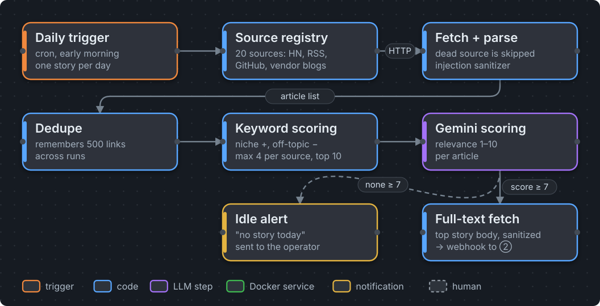
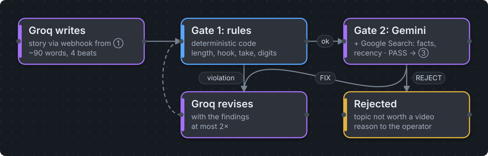
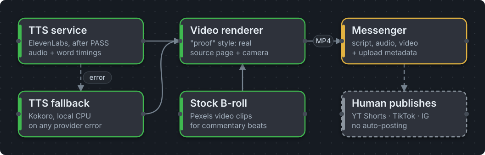

# Automated Short-Form Video Pipeline

A self-hosted, event-driven pipeline that turns the day's most relevant tech story into a **ready-to-publish vertical video** (1080×1920, 30–45 s): source discovery, scripting, two automated quality gates, neural voice with word timings, and a renderer that shows the **actual source page** while the voice quotes it. A human publishes — nothing is auto-posted.

> This is a **sanitized showcase** of a private production system. Service code is real and runnable; orchestration workflows, credentials and channel configuration stay private. All secrets are injected via environment files that never touch the image or the repo.

### ① Scout — finds the story of the day



Pulls ~20 sources (Hacker News, RSS, GitHub search, vendor blogs), drops duplicates and off-topic items with a cheap keyword score, lets Gemini rate the top 10 and forwards the best one — with its article body — if it scores ≥ 7.

### ② Script & quality gates — checked before anything costs money



Groq writes a ~90-word script. **Gate 1** is deterministic code (length, hook, a concrete "my take", no digits/hype/CTAs). **Gate 2** is a *different* model with live Google Search that checks recency, facts, niche fit and advertiser safety. `FIX` sends precise findings back to the writer (max. 2 rounds), `REJECT` drops the topic.

### ③ Voice, video, delivery



The TTS service returns audio **and** per-word timestamps in one call. The renderer uses them to scroll a phone-width capture of the source page and highlight the exact figure at the moment it is spoken; commentary beats run on stock B-roll. Script, audio, video and upload metadata land in a messenger — a human reviews and publishes.

## Components

| Path | Stack | What it does |
|---|---|---|
| [`services/tts`](services/tts) | FastAPI, ElevenLabs | Text → MP3 **plus word-level timings** from a single `with-timestamps` call (no second transcription pass, no double credits). Voice selectable per request. |
| [`services/tts-fallback`](services/tts-fallback) | FastAPI, Kokoro (ONNX, INT8) | Fully local CPU fallback. Model baked into the image at build time; the pipeline still ships audio if the provider fails or rate-limits. |
| [`services/video-renderer`](services/video-renderer) | FastAPI, Playwright/Chromium, Pillow, FFmpeg | Renders the MP4. Styles: **`beweis`** ("proof": source-page capture + virtual camera + highlights, B-roll for commentary), `motion` (kinetic typography) and `slideshow`, each falling back to the next if its inputs are missing. |
| [`quality-gates`](quality-gates) | n8n Code nodes (JS) | Gate 1 rule check, verdict + revision loop, revision parser — with a dependency-free test suite. |
| [`deploy`](deploy) | bash, git, docker compose | One-command deploy of a single service: `git pull` → copy build context → rebuild only that container. |

The orchestration layer (two n8n workflows) is described in [`docs/architecture.md`](docs/architecture.md); the workflow exports stay private.

## Design decisions

- **Show the proof, not stock footage.** When the voice says "twenty dollars", the source page is on screen and `$20` gets underlined. Numbers are matched across spellings (`twenty dollars` → `$20`, `five-hour` → `5-hour`), negations ("killed the limit") are struck through. This is the difference between commentary and interchangeable AI content — and what platform "inauthentic content" policies look for.
- **Automated gates instead of per-video approval.** Two checks with different failure modes: cheap deterministic rules first, then an independent model with web access for everything that changes over time. A model reviewing its own output is not a gate.
- **Word timings are the backbone.** One TTS call yields audio and timestamps; captions, camera moves and highlights all sync to them. Whisper stays only as a fallback.
- **Fallback chains everywhere.** Provider TTS → local Kokoro. `beweis` → `motion` → `slideshow`. A dead RSS feed is skipped, not fatal.
- **Human-in-the-loop by design.** The pipeline prepares; a human publishes. Quality gate and compliance decision (EU AI Act transparency, platform policies).
- **Secrets via `env_file`, never in images.** Keys live in `.env` files on the host, excluded from build context and git.
- **Untrusted input stays data.** The renderer only opens public `http(s)` hosts — checked for the source, every redirect, every subresource and the preview image — so a request cannot point the browser at internal services. Request sizes and durations are capped, work directories are always removed, and article text enters LLM prompts as a fenced data block.
- **Internal-only networking.** Services `expose` ports to the Docker network instead of publishing them. The attack surface is SSH plus one localhost-bound UI.
- **Surgical workflow deploys.** Updates go through the n8n REST API by replacing only the targeted nodes (`GET` → mutate by node name → `PUT` → deactivate/activate), so live credentials survive every deploy.

## Engineering notes (hard-won)

- **Headless CLI agents can "succeed" with zero output.** An agent CLI that silently lacked a file-read permission returned 0 bytes with exit code 0. Treat empty output as failure, never trust the exit code alone — and put source text into the prompt instead of file paths.
- **A capture beats a screen recording.** Playwright's video recording stutters on 2 vCPUs. A single full-page capture plus a virtual camera in Python renders smoothly and deterministically.
- **Zoom has a ceiling.** Above ~16 % the camera cut text lines mid-word on phone-width captures.
- **Stock search needs a per-story ledger.** Without one, every pricing story got the same "finance data screen" clips — channel-wide repetition is exactly the pattern platforms flag.
- **`cmd | head -c N` under `set -o pipefail` kills the script with exit 141** (SIGPIPE). Truncate in bash (`${VAR:0:N}`) instead.
- **n8n stores binaries out-of-band.** `$input.first().binary.data.data` can be a stub; use `await this.helpers.getBinaryDataBuffer(0, 'data')` in Code nodes.
- **`continueOnFail` hides HTTP errors** — downstream nodes silently get `json.error` instead of `binary.data`. Only use it where an explicit IF handles the error branch.
- **A blanket `docker compose up -d` can recreate containers with an empty environment** if some variables come from the shell. Deploy per service with `--no-deps`.
- **Few-shot examples must model the exact target orthography.** ASCII-transliterated examples made the model transliterate its whole output — very audible in TTS.

## Running it

```bash
cp services/tts/.env.example services/tts/.env                        # ElevenLabs key + voice
cp services/video-renderer/.env.example services/video-renderer/.env  # Pexels key
docker compose -f docker-compose.example.yml up -d --build
```

- `POST http://tts:5502/tts` with `{"text": "..."}` → `{audio_base64, words:[{word,start,end}], ...}`
- `POST http://tts-fallback:5501/tts` with `{"text": "..."}` → MP3
- `POST http://video-renderer:8788/render` with audio (base64), `words`, `link`, `title`, `style: "beweis"` → MP4

Each service exposes `GET /health`. Tests: `node quality-gates/test_protokolle.mjs` and `pytest services/video-renderer/tests`.

## License

MIT
