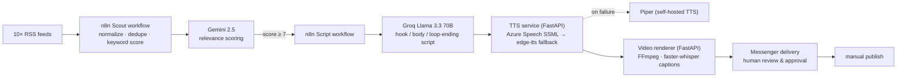

# Automated Short-Form Video Pipeline

A self-hosted, event-driven pipeline that turns RSS news into **ready-to-review short-form videos** (1080×1920, ~30s) — fully automated from article discovery to rendered MP4, with a deliberate **human-in-the-loop** before anything gets published.

> This is a **sanitized showcase** of a private production system. Service code is real and runnable; orchestration workflows, credentials and business configuration stay private. All secrets are injected via environment files that never touch the image or the repo.

## Architecture



All services run as Docker containers on a single hardened VPS, joined in one internal Docker network. **Nothing except n8n (bound to localhost) and SSH is exposed** — services talk to each other via service hostnames, never via published ports.

## Components

| Service | Stack | What it does |
|---|---|---|
| [`services/tts`](services/tts) | FastAPI, Azure Speech, edge-tts | Text→MP3 with a **two-stage engine chain**: Azure Neural TTS via SSML (emphasis for CAPS words, prosody control) with transparent fallback to edge-tts. Callers never notice which engine answered (`X-TTS-Engine` header tells you). |
| [`services/tts-fallback`](services/tts-fallback) | FastAPI, piper-tts | Fully **offline** third-stage TTS. If both cloud engines fail, the pipeline still ships audio. |
| [`services/video-renderer`](services/video-renderer) | FastAPI, FFmpeg, faster-whisper | Renders 1080×1920 MP4: fetches article OG-image + stock photos, transcribes the TTS audio with word-level timestamps, burns in **kinetic pop-in captions** (ASS subtitles), Ken-Burns motion, color grade, film grain, watermark. |
| `deploy/` | bash, git, docker compose | One-command deploy: `git pull` → copy build contexts → `docker compose up -d --build <service>`. |

The n8n orchestration layer (two workflows: *Scout* and *Script Generator*) is documented in [`docs/architecture.md`](docs/architecture.md) — the workflow JSONs themselves remain private.

## Design decisions

- **Human-in-the-loop by design.** The pipeline prepares; a human reviews and publishes. This is both a quality gate and a compliance decision (EU AI Act transparency, platform "inauthentic content" policies).
- **Fallback chains everywhere.** TTS degrades Azure → edge-tts → Piper. Image sourcing degrades article OG-image → stock API. A single provider outage never kills the daily video.
- **Secrets via `env_file`, never in images.** API keys live in `.env` files on the host, excluded via `.dockerignore` and `.gitignore`. Rotating a key = editing one file + `docker compose up -d`.
- **Internal-only networking.** Services `expose` ports to the Docker network instead of publishing them to the host. The attack surface is SSH + one localhost-bound UI.
- **Surgical API deploys.** Workflow updates are pushed through the n8n REST API by replacing only the targeted nodes (`GET` → mutate by node name → `PUT` → deactivate/activate cycle), so live credentials and voice settings survive every deploy.

## Engineering notes (hard-won)

- **n8n stores binaries out-of-band.** `$input.first().binary.data.data` can return a 13-char stub instead of the payload — the real bytes live in the binary data manager. Fix: `await this.helpers.getBinaryDataBuffer(0, 'data')` in Code nodes.
- **piper-tts: `synthesize()` returns raw PCM** without a WAV header; FFmpeg rejects it. Only `synthesize_wav()` writes a valid header.
- **piper-tts 1.2.x wheels don't build on Python 3.12** → pin the base image to `python:3.11-slim`.
- **faster-whisper imports `requests` but doesn't declare it**, and needs `libgomp1` on slim images (ctranslate2/onnxruntime) — both fail only at runtime.
- **Don't fight `host.docker.internal` + firewalls.** Putting services into the same Docker network and addressing them by service hostname is simpler and safer.
- **LLM few-shot examples must model the exact target orthography.** ASCII-transliterated examples (`ue` for `ü`) made the model transliterate its entire output — a one-character prompt bug with very audible consequences in TTS.
- **`continueOnFail` hides HTTP errors:** downstream nodes silently receive `json.error` instead of `binary.data`. Only use it where an explicit IF catches the error branch.

## Running it

```bash
cp services/tts/.env.example services/tts/.env                    # Azure key (optional — falls back to edge-tts)
cp services/video-renderer/.env.example services/video-renderer/.env  # stock photo API key
docker compose -f docker-compose.example.yml up -d --build
```

Then: `POST http://tts:8787/tts` with `{"text": "...", "voice": "de-DE-FlorianMultilingualNeural"}`, and `POST http://video-renderer:8788/render` with audio (base64) + title. Each service exposes `/health`.

## License

MIT
